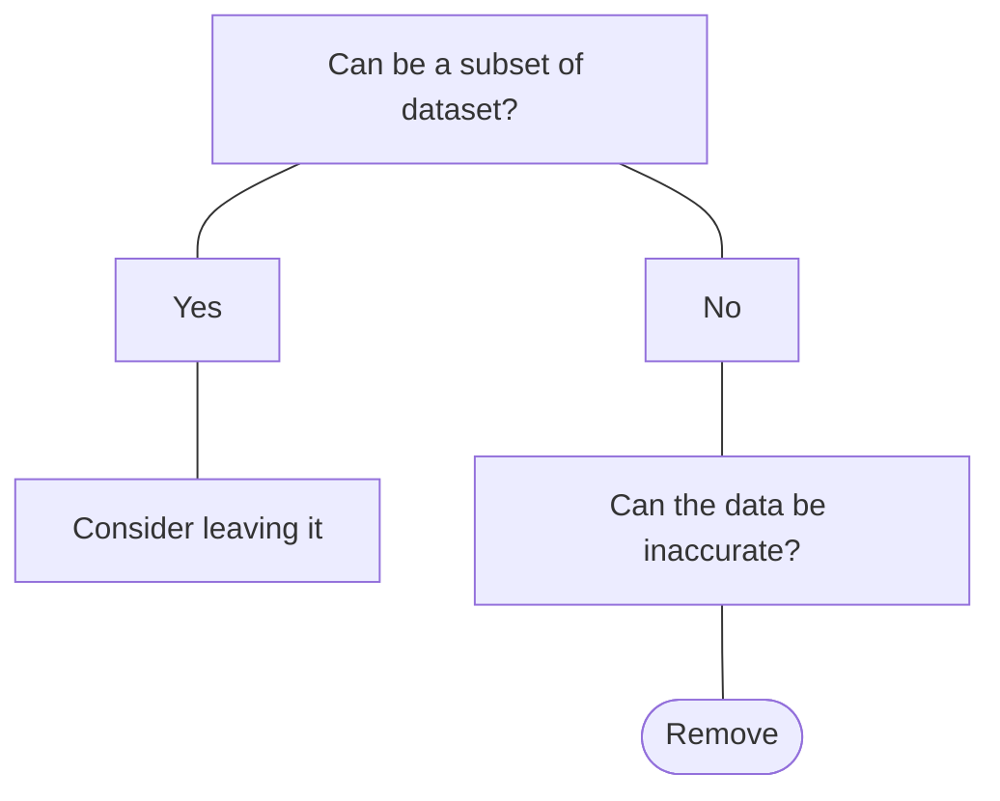

# 3 Data cleaning
## 3.1 Addressing missing data

Missing data is a problem because

 - it can affect distributions
 - data is less representative of the population
 - can result in incorrect conclusions


**Checking for missing values**
`df.isna().sum()` Output contains all columns with missing values, and the quantity of missing value's observations.

**Strategies for missing values**

 
|Strategy|When to use|
|:--|:--:|
|Drop missing values|5% or less of total values|
|Impute by summary statistic (mean, median, mode)|It depends on distribution and context|
|Impute by sub-group|If we can identify different subgroups|


 1.  Drop columns with insufficient data
```python
#1. Calculate missing value threshold (more than 5% missing data is an indicator of low quality of data)
threshold = len(df) * 0.05
#2. Filter for columns with missing values with more missing values than threshold
cols_to_drop = df.columns[df.isna().sum() <= threshold]
#3. Drop columns with not enough data quality
df.dropna(subset = cols_to_drop, inplace = True)
```
 2. Imputation: Replace Missing Values by a summary statistic
```python
# 1. Identified columns with missing values
cols_with_missing_values = df.columns[df.isna().sum() > 0]
# 2. Impute the summary statistic
for col in cols_with_missing_values:   #we can select the appropriate columns to apply the loop, for example by leaving aside the last column: cols_with_missing_values[:-1]
	df[col].fillna(df[col].stat[0]) #with stat = mode|median|mean
``` 
 3. Imputation by sub - group
```python
# 1. Create a dictionary with the median (or other stat) by category
df_dict = df.groupby('cat_col')['num_col'].median().to_dict()
# 2. Impute by sub-group
df['num_col'] = df['num_col'].fillna(df['cat_col'].map(df_dict))
```

## 3.2 Working with categorical data

**Previewing categorical data**
`df.select_dtypes("object").head()`

_script to find out which non-numeric columns in the dataset have a large number of unique values_
```python
# Filter the DataFrame for object columns
non_numeric = planes.select_dtypes("object")
# Loop through columns
for  col  in  non_numeric.columns:
# Print the number of unique values
	print(f"Number of unique values in {col} column:",non_numeric[col].nunique())
```


**Examining frequency values**
```python
# Examining frequency values
df['cat_col'].value_counts()
# Examining quantity of unique values
df['cat_col'].nunique()
# Visualizing category frequency
sns.countplot(data = df, x = 'cat_col')
```

**Creating groups to analyze data**
`df['cat_col'].str.contains("search_word")` allows to search a column for a specific string or multiple strings

_create groups to analize data_
```python
# to find multiple phrases in strings (search_w1 and search_w2) we use the following command: 
# df['cat_col']str.contains("search_w1|search_w2")
# 1. Define a list with the new categories to use
new_categories = ["Group 1", "Group 2"]
# 2. Define variables containing the words or phrases to found
group_1 = "search_w1|search_w2"
group_2 = "search_w3|search_w4"
# 3. Define conditions list
conditions = [df['cat_col'].str.contains(group_1),
			  df['cat_col'].str.contains(group_2)]
# 4. Create new categorical column
df['new column'] = np.select(conditions, new_categories, default = "Others")
```

## 3.3 Working with numerical data


**Cleaning numeric data**
_Convert string to numbers_
```python
# 1. Remove comma values using pandas `str.replace method`
df['num_col'] = df['num_col'].str.replace("characters to remove", "caracthers to replace them with")
# 2. Change data to float
df['num_col'] = df['num_col'].astype(float)
```
_Create column in another currency_
```python
# Create column converting the currency
df['newcur_col'] = df['num_col'] * f_ER # where f_ER is exchange rate
```

**Adding summary statistics into DataFrame**

Add a column in the data frame with a statistic (mean|std) depending on some categorical group

_Add a summary column_
```python
# Add a summary column
df['sum_col'] = df.groupby('cat_col')['num_col'].transform(lambda x:x.stat()) # with stat = mean|std|median
```

## 3.4 Handling outliers
><ins>Definition<ins> 

>_Outlier_: Observation that is far away from other data points

Identifying and dealing with outliers is an integral step in performing exploratory data analysis.


**Identify outliers**
Interquartile range
$$IQR = 75th - 25th percentile$$
$$Upper_Outliers > 75th percentile + (1.5 * IQR)$$
$$Lower_Outliers < 25th percentile - (1.5 * IQR)$$
```python
# Identify outliers
# 1. Identify 25th and 75th percentile
p75 = df['num_col'].quantile(0.75) ## 75th percentile
p25 = df['num_col'].quantile(0.75) ## 75th percentile
# 2. Calculate IQR
iqr = p75 - p25
# 3. Calculate upper and lower threshold
upper = p75 + (1.5 * iqr)
lower = p25 - (1.5 * iqr)
# 4. Subset data to identify outliers
df[df['num_col'] < lower | df['num_col'] > upper]
```

**What to do with outliers**
Outliers are extreme values, and may not accurately represent our data.  In that sense they can skew mean and standard deviation.

1. Try to understand why they exist (sometimes are representative of a subset of the data, sometimes are a signal of data misrepresentation)
2. Could data be inaccurate?


_Remove outliers_
```python
# Remove outliers
df_no_outliers = df[df['num_col'] > lower | df['num_col'] < upper]
```
<!--stackedit_data:
eyJoaXN0b3J5IjpbLTEwMTE1NDczMzRdfQ==
-->