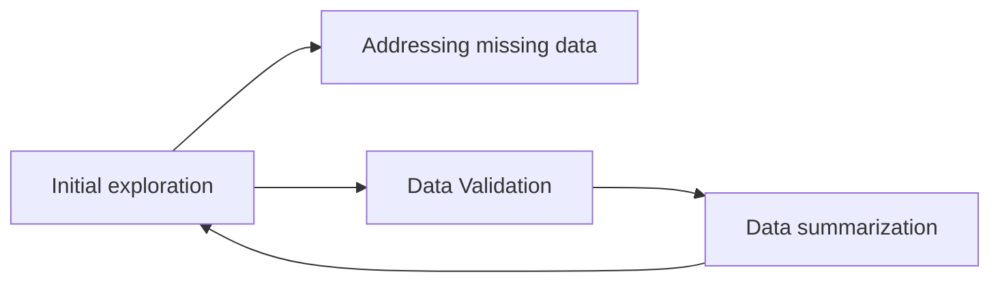

Exploratory data analysis
=

# 1.1 Introduction
Exploratory data analysis (EDA) is _the process of reviewing and cleaning data to_
 - _derive insights as descriptive statistics and correlations_
 - _generate hypotheses for experiments_

## EDA phases



# 2 Getting to know the dataset
## 2.1 Initial exploration

**Descriptive methods**
head: `df.head()` to take a quit look to the top of a Dataframe
info: `df.info()` to summarize number of missing values, types of columns data and memory usage
value_counts: `df.value_counts('cat_col')` or `df['cat_col'].value_counts()`to analyze how many data points are in each category of categorical columns
describe: `df.describe()` quick understanding of numerical columns
data types: `df.dtypes`  quick overview of data types of each column

**Visualizations**
_Histograms_
```python
import seaborn as sns
import matplotlib.pyplot as plt
sns.histplot(data = df, x = 'num_col') #(alt attribute: binwidth = float)
plt.show()
```

## 2.2 Data Validation
The goal of this step is to understand whether data types and ranges are as expected before progress in our a analysis.

1. **Data types**
 Exploration: `df.dtypes`
 Update data types with astype: `df['column'] = df['column'].astype(int)` 

|Type|Python Name|
|-|-|
|String|`str`|
|Integer|`int`|
|Float|`float`|
|Dictionary|`dict`|
|List|`list`|
|Boolean|`bool`|

2.  **Validate categorical data **
Using `isin`

 ```python
df.['cat_col'].isin(["opt1","opt2"]) # to check if column values are limited to opt_x
df[~df.['cat_col'].isin(["opt1","opt2"])]  # select true for al the cases that are not opt1 or opt2
```
 
3.  ** Validate numerical data**
_Value range of a column_
```python
min = df[num_col].min()
max = df[num_col].max()
```
 _boxplot to see distribution of data_
 ```python
 sns.catplot(x = 'num_col', data = df, kind = 'box')
 plt.show()
 ```


## 2.3 Exploring data
### Data summarization - Exploring groups of data

**Simple grouping**
`.group_by()` allows to group data by category, with an aggregating function that indicates how to summarize grouped data (mean|count|min|max|sum|var|std)

Example:
`df.group_by['cat_col'].mean()` (functions are applied only to numerical columns of the DataFrame)


**Aggregating ungrouped data**
`.agg` applies aggregating functions across a DataFrame
`df.agg(['mean', 'std'])` (functions are applied only to numerical columns of the DataFrame)

**Named summary columns**
```python
df.groupby('cat_col').agg(mean_newcol = ('num_col', 'mean'),std_newcol = ('num_col', 'std'))
```
**Visualizing categorical summaries**
_bar plot_
```python
sns.barplot(data = df, x = 'cat_col', y = 'num_col') #or sns.catplot(x =  x = 'cat_col', y = 'num_col', data = df, kind = 'bar')
plt.show()
```

<!--stackedit_data:
eyJoaXN0b3J5IjpbLTEwNzIzODY1NjddfQ==
-->